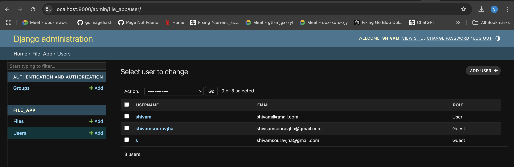

# Secure File Sharing Application

This repository contains a **Secure File Sharing** application with a **React** frontend and a **Django** backend. It utilizes SSL certificates for secure communication and is containerized using **Docker Compose**.

---

## Table of Contents

- [Overview](#overview)
- [Prerequisites](#prerequisites)
- [Frontend Setup](#frontend-setup)
- [Backend Setup](#backend-setup)
- [Running the Application](#running-the-application)
- [Creating the First Admin User](#creating-the-first-admin-user)
- [Troubleshooting](#troubleshooting)

---

## Overview

This application provides a secure platform for sharing files between users. Both the frontend and backend use self-signed SSL certificates for encrypted communication, ensuring a secure connection.

---

## Prerequisites

1. Install [Node.js](https://nodejs.org/) (for the frontend).
2. Install [Docker](https://www.docker.com/) and [Docker Compose](https://docs.docker.com/compose/).
3. Install [mkcert](https://github.com/FiloSottile/mkcert) to generate self-signed SSL certificates:
   ```bash
   brew install mkcert
   ```

---

## Frontend Setup

1. **Navigate to the frontend directory**:
   ```bash
   cd secure-file-sharing
   ```

2. **Install dependencies**:
   ```bash
   npm install
   ```

3. **Generate SSL Certificates**:
   Run the following command to generate self-signed certificates:
   ```bash
   mkcert localhost 127.0.0.1 ::1
   ```
   Ensure the generated `.pem` and `.key` files are correct and note their paths.

4. **Update Environment Variables**:
   Create or update the `.env` file in the frontend directory with the paths to the SSL certificate and key:
   ```env
   SSL_CRT_FILE=/path/to/localhost.pem
   SSL_KEY_FILE=/path/to/localhost-key.pem
   ```

5. **Start the Frontend**:
   Run the following command to start the development server:
   ```bash
   npm start
   ```

---

## Backend Setup

1. **Navigate to the backend directory**:
   ```bash
   cd secure_file_sharing
   ```

2. **Generate SSL Certificates**:
   Similar to the frontend setup, generate SSL certificates for the backend:
   ```bash
   mkcert localhost 127.0.0.1 ::1
   ```

3. **Run the Backend**:
   Use Docker Compose to build and run the backend services:
   ```bash
   docker-compose up --build
   ```

---

## Running the Application

1. Access the application at `https://localhost:3000`.

---

## Creating the First Admin User

1. **List Running Containers**:
   ```bash
   sudo docker ps
   ```
   Identify the backend container name, which is usually in the format `secure_file_sharing-web-1`.

2. **Access the Backend Container**:
   ```bash
   docker exec -it secure_file_sharing-web-1 bash
   ```

3. **Create a Superuser**:
   Inside the container, run the following command:
   ```bash
   python manage.py createsuperuser
   ```
   Enter the following details when prompted:
   - **Username**
   - **Email Address**
   - **Password**

4. **Exit the Container**:
   ```bash
   exit
   ```

5. **Access the Admin Panel**:
   Open your browser and navigate to:
   ```
   https://localhost:8000/admin/login/?next=/admin/api
   ```
   Log in with the superuser credentials you created.

6. **Update the User Role**:
   Navigate to the Django admin panel at:
   ```
   https://localhost:8000/admin/
   ```
   - Go to the **Users** section.
   - Select the user you want to assign the admin role.
   - Update their role and save the changes.




> **Note**: Once this setup is complete, all user roles can be managed directly through the platform interface without needing to access the admin panel again.
---

## Troubleshooting

- **SSL Certificate Errors**:
  - Ensure the correct paths to the `.pem` and `.key` files are set in the `.env` files for both frontend and backend.

- **Docker Issues**:
  - If Docker Compose fails, try rebuilding the containers:
    ```bash
    docker-compose down --volumes
    docker-compose up --build
    ```

- **Port Conflicts**:
  - Ensure no other services are running on ports `8000` (backend) or `3000` (frontend).

---
